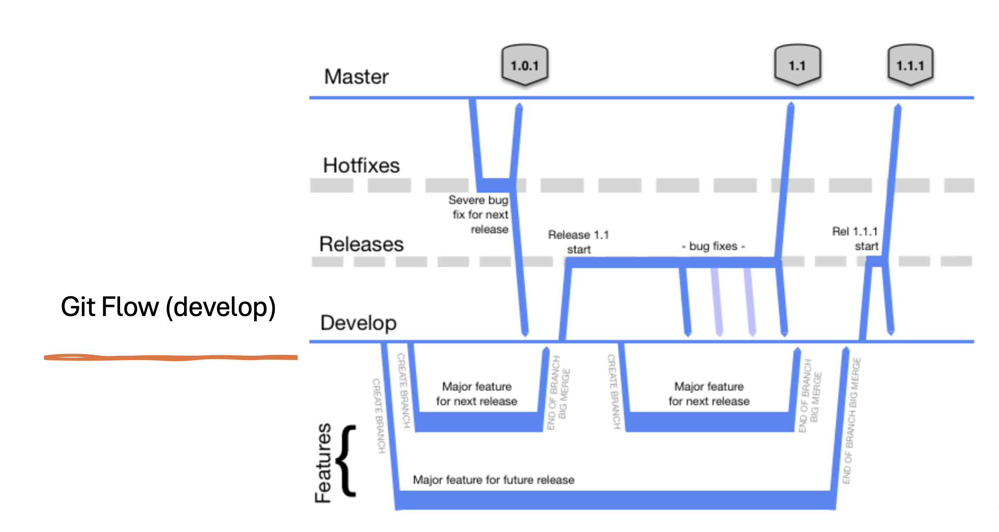

# mmo-ecc-orchestration-svc

- Api layer for https://github.com/TransformCore/mmo-ecc-fe

## Pre-requisites

- node (12) & npm
- redis server (installed locally for dev and for prod Azure redis cache will be used)
- mongodb (installed locally for dev and for prod cosmos db will be used)

For local installation please refer to your OS documentation,

- MacOS: `brew install redis mongodb` (The default config should be fine for local development)
- Windows: `??` (The default settings should work I think!)

# Things to Consider

- This repository should use GitFlow as a branching strategy.
  
- If you won't call your branch as per agreed branching `standards`, the Azure pipeline won't start or may fail to deploy an image.

## Development

For development, the pre-requisites are

- local redis server is running on localhost port 6379 without password
- local mongo server is running on localhost port 27017 without password
- take a copy of the `.envSample` file and save it as `.env` - this will set the default env vars required for running the project.

Use the following targets,

- `npm start` will start without auth
- `npm run start-with-auth` will start with auth

## Running with Docker Compose

Requires Docker, and `NPM_TOKEN` declared in a `.env` file at the project root — the `test`/`development` image targets run `npm ci` against the private `mmo-shared-reference-data` Azure Artifacts feed (see `.npmrc`).

### Set up `NPM_TOKEN`

1. Create a Personal Access Token in Azure DevOps (`https://dev.azure.com/defragovuk` → User settings → Personal access tokens) with **Packaging → Read** scope.
2. Copy `.envSample` to `.env` if you haven't already, then add the token as a line in `.env` (project root, already gitignored, so it's only used locally and never committed):

   ```bash
   NPM_TOKEN="<your-pat>"
   ```

   Docker Compose automatically reads `.env` in the project root and substitutes `${NPM_TOKEN}` into the build `args` in `docker-compose.yml`/`docker-compose.test.yml` — no shell export needed. This also means every `docker compose` command must be run from the project root so `.env` is picked up.
3. Verify it's set before running any of the commands below:

   ```bash
   grep -q '^NPM_TOKEN=.\+' .env && echo "NPM_TOKEN is set" || echo "NPM_TOKEN is NOT set"
   ```

Never commit a PAT, print it in logs, or share it — see the warning already in `.npmrc`.

### 1. Shared infra (run first, from any app)

`docker-compose.deps.yml` provisions mongo + redis on the common `fes-shared-net` network, shared across all FES apps. Start it once and leave it running:

```bash
docker compose -f docker-compose.deps.yml up -d --wait
```

Mongo is on `127.0.0.1:27017` and Redis on `127.0.0.1:6379` for host tools (e.g. `npm start`, a Mongo GUI). Data persists in named volumes across restarts; `docker compose -f docker-compose.deps.yml down -v` wipes them.

### 2. Run the app

Preferred — containerised, with hot-reload (joins `fes-shared-net`, base `docker-compose.yml` + dev overlay `docker-compose.override.yml` are merged automatically):

```bash
docker compose up --build
```

Backup — on the host (needs the shared infra from step 1 and a `.env` copied from `.envSample`):

```bash
npm start
```

### 3. Unit tests

Runs against an isolated, ephemeral mongo (own `test-net`, no shared infra, no host port) — the same command is used locally and in CI:

```bash
docker compose -f docker-compose.test.yml run --rm --build test
```

`--build` forces a rebuild so the image always reflects your latest code — `docker compose run` reuses an existing image otherwise and can silently test stale code. This is also what runs in the `pre-push` git hook, blocking the push if tests fail.

### Troubleshooting

#### Error "no such file or directory: ./node_modules/pre-commit/hook" when commiting a change

This is likely due to a `husky` misconfiguration. You should be able to resolve this issue with a clean install of the packages

```bash
rm -rf ./node_modules && npm i
```

If you are still having trouble please see the [husky troubleshooting guide](https://typicode.github.io/husky/troubleshoot.html)

## Environment variables

Look up applicationConfig.ts

## To build and run

```bash
cd mmo-ecc-orchestration-svc
npm i
npm start
```

Then query http://localhost:5500/v1/vessels/search?name=SHA

If the page has to be secured, use env variable USE_BASIC_AUTH=true.

```bash
npm run start-with-watch
```

To run the tests:

```bash
npm run test
```

Coverage information can be found on `coverage/index.html`. It produces cobertura format report too which is used only in VSTS.

_Note_: if you are having issues with ARM architecture, add `MONGOMS_ARCH=arm64` to your `.env` file.

## To run in docker

Make sure you have docker installed and ready to go! See: https://docs.docker.com

Build

```bash
docker build -t mmo-ecc-orchestration-svc .
```

Run

```bash
docker run -p 5500:5500 --name mmo-ecc-orchestration-svc mmo-ecc-orchestration-svc
```
